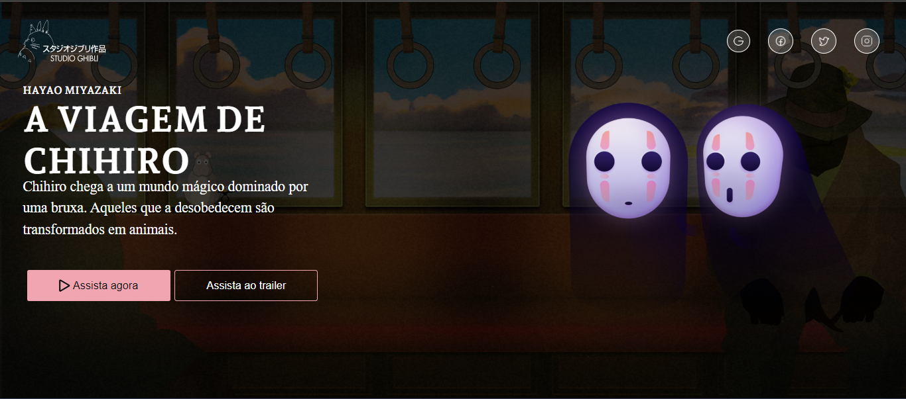

# studioghibli-challenge

Desafio feito a partir de repositório do github [https://github.com/iuricode/desafios-frontend](https://github.com/iuricode/desafios-frontend)

Projeto feito para treinar habilidades com HTML5 e responsividade com CSS, incluso ao projeto temos o docker que sobe uma imagem e um container compose

## Instruções de uso

Para rodar o projeto localmente:

- Instale o Docker e Docker Compose
- Clone este repositório
- Na raiz do projeto, execute `docker-compose up`
- Acesse http://localhost:5173 no seu navegador

O projeto consiste em uma página simples com informações do filme A Viagem de Chihiro do Studio Ghibli. Foi desenvolvido com foco em HTML5 semântico e CSS responsivo.

## Tecnologias

- HTML5
- CSS3
- React + Vite
- Docker
- Docker Compose

## Contribuindo

Pull requests são bem-vindos! Sinta-se à vontade para contribuir com este projeto.

1. Faça um fork deste repositório
2. Crie uma branch com sua feature (`git checkout -b feature/minhaFeature`)
3. Faça commit das suas mudanças (`git commit -m 'Adicionando minha feature'`)
4. Faça push para a branch (`git push origin feature/minhaFeature`)
5. Abra um Pull Request
